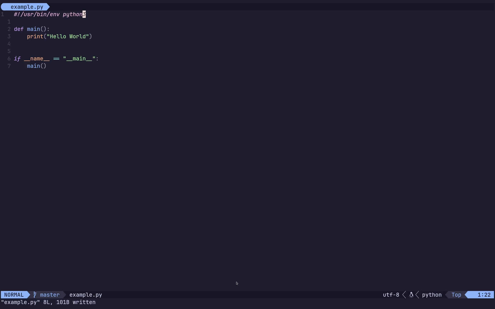

# Comment Highlighter

Comment Highlighter is a Neovim plugin that enhances your coding experience by highlighting TODO, FIXME, and NOTE comments in your code. It supports multiple programming languages and allows for easy color customization.

[](demo/demo.mp4)

## Features

- Highlights TODO, FIXME, and NOTE comments
- Supports multiple programming languages
- Easy color customization
- Efficient highlighting on buffer events

## Installation

### Using [packer.nvim](https://github.com/wbthomason/packer.nvim)

Add the following line to your Neovim configuration:

```lua
use {
  'your-username/comment-highlighter',
  config = function()
    require('comment_highlighter').setup()
  end
}
```

### Using [lazy.nvim](https://github.com/folke/lazy.nvim)

Add the following to your Neovim configuration:

```lua
{
  'your-username/comment-highlighter',
  config = function()
    require('comment_highlighter').setup()
  end
}
```

### Using [vim-plug](https://github.com/junegunn/vim-plug)

Add the following line to your Neovim configuration:

```vim
Plug 'your-username/comment-highlighter'
```

Then, add this to your configuration:

```vim
lua require('comment_highlighter').setup()
```

## Configuration

You can customize the colors of the highlighted comments by passing a table to the `setup` function:

```lua
require('comment_highlighter').setup({
  colors = {
    todo = '#FFA500',  -- Orange
    fixme = '#FF69B4', -- Hot Pink
    note = '#00CED1',  -- Dark Turquoise
  }
})
```

### Default Colors

If you don't specify custom colors, the plugin will use these default colors:

- TODO: Dark Orange (`#FF8C00`)
- FIXME: Red (`#FF0000`)
- NOTE: Dodger Blue (`#1E90FF`)

## Keywords
- TODO comment
- FIXME comment
- NOTE Comment


## Supported Languages

The plugin supports comment highlighting for the following languages:

- Lua
- Python
- Shell scripts
- Ruby
- Perl
- Vim script
- YAML
- TOML
- INI
- SQL
- C
- C++
- Java
- JavaScript
- TypeScript
- PHP
- CSS
- HTML
- XML

For unsupported file types, the plugin defaults to C-style comments.

### FIXME:

- [ ] Not file type dependant
> I.E. the match for a python comment works on a typescript file too
- [ ] Not matching from the beginning
> I.E. `// TODO: fix stuff` does the same as `// fix stuff TODO` or as `// this is TODO list is amazing `
- [ ] More i haven't found

## Contributing

Contributions are welcome! Please feel free to submit a Pull Request.

## License

This project is licensed under the MIT License - see the [LICENSE](LICENSE) file for details.
